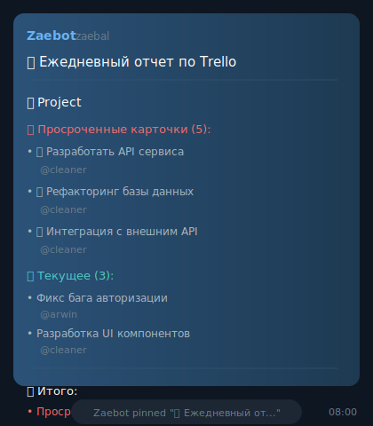

<h1 align="center">
  
  <br>
  🤖 Trello Telegram Tracker Bot
</h1>

<p align="center">
  <strong>A powerful Telegram bot for monitoring Trello boards with automated reports and real-time notifications</strong>
</p>

<p align="center">
  
  
  
  
</p>

<p align="center">
  📊 <strong>Daily Reports</strong> • 🔔 <strong>Real-time Notifications</strong> • 🎯 <strong>Interactive Commands</strong>
</p>

<br>

**The bot's language has been translated to English.**

## ✨ Features

### 📊 **Automated Reporting**
- **Daily Reports** - Automated daily reports (Mon-Sat at 8:00 AM) with overdue and current tasks
- **Weekly Statistics** - Weekly performance analytics (Monday at 12:00 AM) with completed tasks
- **Smart Pinning** - Automatic report pinning with old message cleanup

### 🔔 **Real-time Notifications**
- **Card Completion** - Instant notifications when cards are moved to "Done" lists
- **Member Assignments** - Alerts when team members are assigned to tasks
- **Long-running Tasks** - Visual indicators (🐌) for tasks in progress >3 days

### 🎯 **Interactive Commands**
- `/start` - Show help and command list
- `/ct` - Current report for all boards
- `/wr` - Weekly statistics
- `/mt` - Personal tasks (user-specific)
- `/stored` - Show pinned messages
- `/unpin MESSAGE_ID` - Unpin specific message
- `/clear_stored` - Clear saved messages
- `/debug_file` - Show storage file contents

### 👥 **User Management**
- **Trello-Telegram Mapping** - Link Trello users with Telegram usernames
- **Personal Task Views** - Individual task reports per user
- **Smart Tagging** - Automatic mentions in notifications


## 🚀 Quick Start

### Prerequisites
- Python 3.12+
- Telegram Bot Token
- Trello API credentials

### Installation

```bash
# Clone the repository
git clone https://github.com/DefaultPerson/trello-telegram-tracker.git
cd trello-telegram-tracker

# Install uv (if not already installed)
curl -LsSf https://astral.sh/uv/install.sh | sh

# Install dependencies
uv sync
```

### Configuration

1. **Create configuration file**:
   ```bash
   # Copy the example configuration
   cp config.example.yaml config.yaml
   ```

2. **Edit configuration**:
   Open `config.yaml` and fill in your credentials:

   ```yaml
   # Telegram Bot Configuration
   telegram:
     api_token: "YOUR_BOT_TOKEN_HERE"  # Get from @BotFather
     peer_id: "YOUR_CHAT_ID_HERE"     # Your chat/channel ID

   # Trello Configuration
   trello:
     api_key: "YOUR_TRELLO_API_KEY"   # Get from https://trello.com/app-key
     token: "YOUR_TRELLO_TOKEN"       # Get from https://trello.com/app-key
     board_ids:
       - "BOARD_ID_1"
       - "BOARD_ID_2"

   # User mapping (optional)
   user_mapping:
     trello_to_telegram:
       "trello_username": "@telegram_username"
   ```

3. **Get your credentials**:
   - **Telegram Bot Token**: Message [@BotFather](https://t.me/BotFather) on Telegram
   - **Trello API Key & Token**: Visit [https://trello.com/app-key](https://trello.com/app-key)
   - **Chat ID**: Add your bot to a group/channel and check the logs, or use [@userinfobot](https://t.me/userinfobot)

### Running the Bot

```bash
# Make sure you've configured config.yaml first!
uv run python -m app
```


## 🛠️ Technology Stack

- **[Python 3.12+](https://python.org)** - Core language
- **[aiogram 3.21+](https://aiogram.dev)** - Telegram Bot framework
- **[aiohttp](https://aiohttp.readthedocs.io)** - Async HTTP requests
- **[aiofiles](https://github.com/Tinche/aiofiles)** - Async file operations
- **[schedule](https://schedule.readthedocs.io)** - Task scheduling
- **[uv](https://docs.astral.sh/uv/)** - Dependency management

## 📋 Card State Detection

The bot intelligently categorizes cards based on list names:

- **✅ Completed Cards**: Lists containing "Done", "Completed", "Finished"
- **🔄 In Progress Cards**: Lists with "In Progress", "Doing", "Working", "Review / QA"
- **⏰ Overdue Cards**: Cards with past due dates
- **🐌 Long-running Cards**: Tasks in progress for more than 3 days

### Scheduling
Modify report timing in the scheduler:

```python
# Daily reports (Monday to Saturday at 8:00 AM)
schedule.every().monday.at("08:00").do(send_daily_report)
schedule.every().tuesday.at("08:00").do(send_daily_report)
# ...

# Weekly statistics (Monday at 00:00)
schedule.every().monday.at("00:00").do(send_weekly_report)
```

## 📝 License

This project is licensed under the MIT License - see the [LICENSE](LICENSE) file for details.

---

<div align="center">

**Made with ❤️ for better project management**

[⭐ Star this repo](https://github.com/DefaultPerson/trello-telegram-tracker) if you find it useful!

</div>


